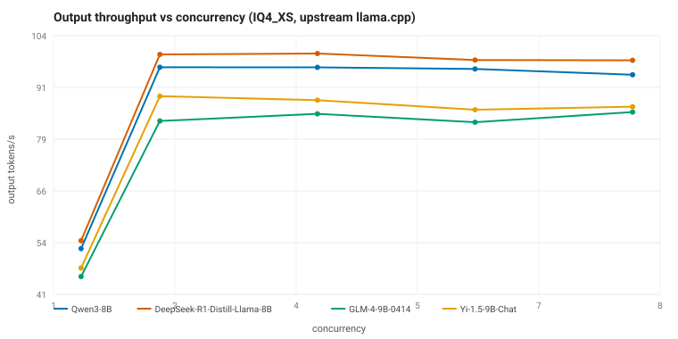
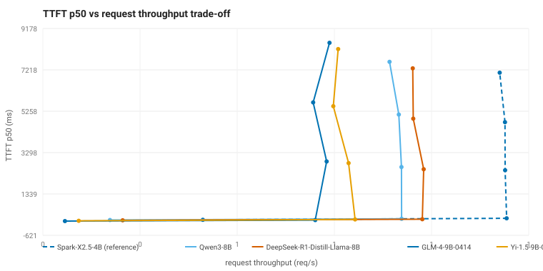

# Local LLM Inference Benchmark

A reproducible benchmark for local LLM inference on a constrained consumer GPU
(NVIDIA RTX 3060 Laptop, 6 GiB VRAM). It measures **two separate things**:

1. **Serving performance** — token throughput, TTFT, VRAM, and energy under a
   controlled serving policy ([docs/methodology.md](docs/methodology.md)).
2. **Coding / software-engineering capability** — direct coding (EvalPlus,
   LiveCodeBench) and agentic SWE (SWE-bench Verified, DeepSWE, Multilingual,
   Terminal-Bench) with mini-swe-agent
   ([docs/capability-methodology.md](docs/capability-methodology.md)).

The two layers use different serving profiles (parallel 2 vs parallel 1), are
reported separately, and are **never** combined into one synthetic score.

- **Current benchmark — mainstream 8-9B cohort:** four dense open-weight
  8-9B models in IQ4_XS quantization, all served by the same pinned upstream
  llama.cpp build under an identical resource policy and workload.
- **Reference baseline — Spark-X2.5-4B:** a 4B model served on the XHToken
  llama.cpp fork (IQ4_XS). It is shown alongside the cohort as a fixed-hardware
  cross-cohort reference, never as a size-matched competitor.

> **Dashboard:** https://jfang2048.github.io/llm_benchmark/
> **Capability results:** [docs/capability-results.md](docs/capability-results.md)

## What this repository does

- Defines a controlled fixed-hardware deployment benchmark
  ([docs/methodology.md](docs/methodology.md)): it measures serving
  performance under one GPU/engine/quantization policy, not model quality.
- Provides two pinned engine profiles (see `configs/models.json`):
  - `upstream_llama_cpp` (`docker/llama-cpp-upstream/`, tag v0.4.0, CUDA arch
    86) for the 8-9B cohort;
  - `xhtoken_llama_cpp` (the Spark-X2.5 XHToken fork) for the reference model.
- Derives the active model set and sweep parameters from a single registry
  (`configs/models.json` + `configs/benchmark.json`); the runner and report
  generator read from it, never from hardcoded model lists.
- Runs the benchmark through a small registry-driven harness (`bench/`) with
  AIPerf as the client.
- Publishes a curated, sanitized dataset under `results/current/` and renders
  a static dashboard from it — every displayed number comes from
  machine-readable `.tsv` files.

## Models

### Current benchmark: mainstream 8-9B cohort

| Model | Parameters | Quantization | License |
|---|---|---|---|
| Qwen3-8B | 8.19B | IQ4_XS | Apache-2.0 |
| DeepSeek-R1-Distill-Llama-8B | 8.03B | IQ4_XS | MIT |
| GLM-4-9B-0414 | 9.40B | IQ4_XS | MIT |
| Yi-1.5-9B-Chat | 8.83B | IQ4_XS | Apache-2.0 |

All four are served as IQ4_XS GGUF artifacts from the same GGUF publisher
(bartowski), each pinned by SHA256 in `configs/models.json`, by the same
pinned upstream `ggml-org/llama.cpp` build. `DeepSeek-R1-Distill-Llama-8B` is
a DeepSeek-distilled Llama-3.1-8B dense model — not the DeepSeek-R1/V3 MoE
architecture.

### Reference baseline: Spark-X2.5-4B

| Model | Parameters | Quantization | Engine |
|---|---|---|---|
| Spark-X2.5-4B | 4.11B | IQ4_XS | XHToken llama.cpp fork |

Spark differs from the cohort in parameter count, serving fork, and
quantization provenance (IQ4_XS quantized locally from the official FP16
GGUF, vs the cohort's Bartowski-published artifacts), so it is reported as a
fixed-hardware reference — not ranked against the 8-9B models. Its engine
profile and commit are pinned in `configs/models.json` exactly like the
upstream build.

## Test system

| Component | Value |
|---|---|
| GPU | NVIDIA GeForce RTX 3060 Laptop GPU, 6144 MiB VRAM |
| CPU | AMD Ryzen 7 6800H |
| Platform | WSL2, Ubuntu 24.04 |
| Engine (8-9B) | ggml-org/llama.cpp, pinned tag v0.4.0 (CUDA arch 86) |
| Engine (Spark) | XHToken llama.cpp fork, pinned commit |
| Serving policy | `--ctx-size 4096 --parallel 2 --n-gpu-layers 999 --cont-batching` |
| Benchmark tool | NVIDIA AIPerf 0.12.0 |

## Quick start

```bash
git clone https://github.com/jfang2048/llm_benchmark.git
cd llm_benchmark
make setup                 # build both engine images + download/quantize models
make smoke                 # admission gate for both cohorts (serve + smoke + VRAM)
make benchmark             # mainstream 8-9B capacity sweep
make spark                 # Spark reference capacity sweep
make report                # rebuild the current dashboard
```

## Benchmark suites

Run via the registry-driven harness (`bench/runner.py`); `make` targets wrap it.

- `make benchmark` / `make spark` — capacity: closed-loop throughput/latency/
  error sweep vs concurrency (1/2/4/6/8, 60 req/cell, 3 repeats, rotated model
  order).
- `make reliability` — transport-reliability gate (≥200 requests, Wilson 95%
  CI on success rate, error classification).
- `make shape` — token-controlled ISL/OSL workload sweep.
- `make open-loop` — Poisson load + achieved-throughput sweep.
- `make startup` / `make soak` / `make sessions` — cold-start latency,
  sustained-load thermal degradation, multi-turn latency.
- `make llama-bench` — raw-engine microbenchmark (pp512/tg128) with the same
  upstream binary; kept separate from the AIPerf end-to-end serving numbers.

Serving is gated on a per-model admission test (`scripts/admit.sh`):
healthcheck, a generation request, a 20-request smoke test, and a VRAM/OOM
check before a model enters the benchmark. Capacity results with `FAILED` or
`UNSTABLE` cells are never presented as valid ranking points.

## Results

> **Interactive dashboard:** https://jfang2048.github.io/llm_benchmark/





The two figures above are static summaries generated from the same data as the
interactive dashboard. Full per-suite results are in [docs/results.md](docs/results.md).

## Reproduce

```bash
make reproduce              # full: both cohorts + dashboard
REPRODUCE_MODE=smoke make reproduce   # fast admission path
```

## Methodology

See [docs/methodology.md](docs/methodology.md) for metric definitions (TTFT,
ITL, E2E latency, throughput), aggregation, and limitations. This is
a fixed-hardware deployment benchmark: numbers are representative of this
exact GPU/engine/quantization envelope, not a general model ranking.

## Data

- Current 8-9B dataset: `results/current/mainstream-8-9b/`.
- Current Spark reference: `results/current/spark-reference/`.
- Historical ~4B cohort: `results/v2/final/` and `docs/history/`.
- Normalized dashboard dataset: `docs/data/current.json` (generated by
  `make report`); the interactive dashboard is `docs/index.html`.

## Limitations

- One GPU, one laptop, one driver version.
- Serving cost, not model quality (accuracy/reasoning).
- Cross-model tokens/s is secondary because tokenizers differ.
- IQ4_XS fits the whole 8-9B cohort at ctx=4096/parallel=2, but the largest
  model (GLM-4-9B) sits near the VRAM ceiling; any CPU-offload variant would
  be recorded explicitly as such.
- Spark-X2.5-4B is a reasoning model (emits `reasoning_content`), so its
  output latency reflects reasoning tokens, not only final content.

## License

No source-code license is asserted for this repository. Model weights are
governed by their own upstream licenses and are not redistributed here.

## Security

Model weights, caches, credentials, raw benchmark cell artifacts, and private
machine paths are excluded (see `.gitignore`). A pre-push gate
(`./scripts/security_check.sh`, also run in CI) checks for secrets, private
paths, oversized files, and non-English text.
