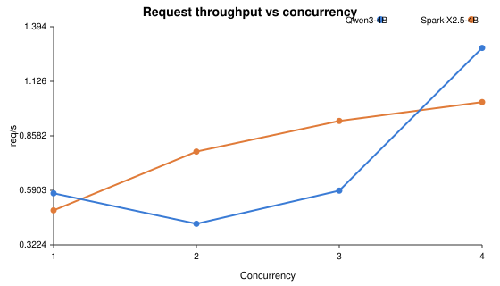
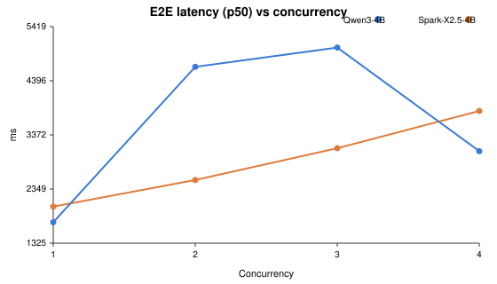

# Reproducible Local LLM Inference Benchmark

A reproducible benchmark for **local LLM inference on a constrained consumer
GPU**. It compares two 4B-class models — **Spark-X2.5-4B** and **Qwen3-4B**,
both in Q4_K_M quantization — served by the **same llama.cpp engine** on an
NVIDIA RTX 3060 Laptop GPU (6 GiB VRAM), under identical runtime settings and
an identical workload.

> **Interactive dashboard:** https://jfang2048.github.io/llm_benchmark/
>
> **Benchmark v2 dashboard:** https://jfang2048.github.io/llm_benchmark/v2/




## What This Repository Does

- Defines a **controlled** benchmark methodology (see [docs/methodology.md](docs/methodology.md)).
- Provides reproducible Docker builds for llama.cpp (with Spark-X2.5 support)
  and vLLM.
- Provides one-command deployment and benchmarking via `make`.
- Publishes a **curated, sanitized** dataset from the validated final run.
- Generates a static interactive dashboard and charts from committed data —
  every displayed number is derived from machine-readable `.tsv` files.

## Experiment Scope

| | |
|---|---|
| Models | Spark-X2.5-4B-Q4_K_M, Qwen3-4B-Q4_K_M |
| Inference engine | llama.cpp (fixed) |
| Quantization | Q4_K_M (fixed) |
| Workload | 100 synthetic English prompts, identical bytes/order |
| Matrix | 2 models x {1,2,3,4} concurrency x 4 repeats |
| Per cell | 80 requests + 5 warmup, output cap 128 tokens |
| Benchmark tool | NVIDIA AIPerf 0.12.0 |

The published comparison isolates a single independent variable — **the model
package** (checkpoint + architecture + tokenizer). It is a serving-cost
comparison, not a model-quality evaluation.

## Hardware and Software Environment

| | |
|---|---|
| GPU | NVIDIA GeForce RTX 3060 Laptop GPU, 6144 MiB VRAM |
| Driver / CUDA | 610.74 / 13.3 |
| CPU | AMD Ryzen 7 6800H (16 logical CPUs) |
| Platform | WSL2, Ubuntu 24.04 |
| Docker | 29.7.2 |
| llama.cpp | XHToken fork (Spark-X2.5 support), CUDA 13.3 build |
| vLLM (context) | 0.26.0 |

Full details: [docs/environment.md](docs/environment.md).

## Historical Results (v1 — diagnostic)

> **Note:** the published run `20260904_192416` is a **historical diagnostic
> benchmark**. It exhibited substantial `ServerDisconnectedError` rates (a
> client-side transport artifact), so it is **not** presented as a trustworthy
> final performance ranking. It is retained as provenance: it helped discover
> the transport instability and motivated **Benchmark v2**, whose reliability
> gate (`./scripts/benchmark.sh reliability`) must pass before any new ranking
> is published.

Request throughput and E2E latency (mean of 4 repeats) for the two models:

| Concurrency | Spark req/s | Qwen req/s | Spark E2E p50 (ms) | Qwen E2E p50 (ms) |
|---:|---:|---:|---:|---:|
| 1 | 0.492 | 0.576 | 2016 | 1721 |
| 2 | 0.781 | 0.426 | 2520 | 4658 |
| 3 | 0.932 | 0.589 | 3121 | 5023 |
| 4 | 1.024 | 1.290 | 3824 | 3066 |

Observed highlights (see [results/final/model_comparison.md](results/final/model_comparison.md)):

- **At concurrency 1, Qwen3-4B is faster** (lower TTFT/ITL/E2E latency, higher
  throughput) with comparable reliability.
- **At concurrency 2–3, Spark-X2.5-4B is faster** — Qwen3-4B shows a throughput
  regression and markedly higher inter-token and end-to-end latency.
- **At concurrency 4, Qwen3-4B recovers** and leads again, but both models show
  nonzero error rates (`ServerDisconnectedError`), so reliability is the gate.

These are deployment measurements on one machine, not a general quality
ranking, and the underlying transport instability means the latency/throughput
differences above should be treated as preliminary until Benchmark v2 passes
its reliability gate.

## Benchmark v2 (current)

Benchmark v2 rebuilds the measurement on a scientifically stronger foundation.
The historical run above is retained as provenance but is **not** a final
ranking; v2 adds a hard reliability gate and staged suites.

- **P0 Reliability gate.** Transport success must reach &ge; 99.5% before any
  performance claim. `./scripts/benchmark.sh reliability` diagnoses transport
  stability (root cause: aiohttp pooled connection reuse racing with the
  llama.cpp HTTP server closing keep-alive connections; fix:
  `--connection-reuse-strategy never`). A final run that fails the gate is
  refused unless `FORCE_UNSTABLE=1`, which marks it `INVALID_FOR_RANKING`.
- **Suites** (each a `make benchmark-*` target, each writing its own result
  files under `results/v2/`):
  - `reliability` — transport stability diagnostic (the gate).
  - `capacity` — closed-loop throughput/error sweep vs concurrency.
  - `shape` — token-controlled ISL/OSL workload sweep.
  - `open-loop` — Poisson load sweep with SLO/goodput compliance.
  - `startup` — process cold-start latency.
  - `soak` — sustained-load + thermal degradation (GPU telemetry).
  - `sessions` — multi-turn latency by turn (+ optional prefix-cache A/B).
  - `backend` — engine comparison (same Qwen GGUF on llama.cpp vs vLLM+GGUF),
    kept separate from the model ranking.
- **Terminology** distinguishes `pass_runs` / `unstable_runs` / `failed_runs` /
  `parsed_runs`, and latency is reported over successful requests only. A
  parsed-but-unstable run is never called valid.
- **Schema, suites, and metric definitions:** [results/v2/README.md](results/v2/README.md).
- **Dashboard:** https://jfang2048.github.io/llm_benchmark/v2/ (capacity,
  shape, SLO/goodput, sessions, Pareto/energy, and run-validity views).

## Quick Start

```bash
git clone https://github.com/jfang2048/llm_benchmark.git
cd llm_benchmark

# 1. Preflight — validate GPU, Docker, ports, models
make preflight

# 2. Download models and build images
make setup

# 3. Deploy benchmark containers
make deploy

# 4. Healthcheck every endpoint
make healthcheck

# 5. Run a fast smoke benchmark
make benchmark-smoke

# 6. Run the full validated benchmark
make benchmark

# 7. Rebuild the interactive report + charts
make report
```

## One-Command Reproduction

```bash
make reproduce
```

Runs preflight -> download -> build -> deploy -> healthcheck -> benchmark ->
report. Idempotent: existing models and images are reused. Use
`REPRODUCE_MODE=smoke ./scripts/reproduce.sh` for a fast validation path.

> **Model note:** Qwen3-4B-Q4_K_M downloads automatically from the official
> Qwen GGUF repo. Spark-X2.5-4B-Q4_K_M has no canonical public GGUF URL — see
> [models/README.md](models/README.md) for the two supported acquisition paths.
> The download script verifies both against pinned SHA256 hashes.

## Benchmark Methodology

See [docs/methodology.md](docs/methodology.md) for the full design, metric
definitions (TTFT, ITL, E2E latency, throughput, error rate), aggregation, and
fairness limitations. The short version:

- One variable changes (the model); engine, quantization, GPU, prompts, order,
  sampling, context, and concurrency are all fixed.
- Error rate is a hard gate; latency and throughput are read together with it.
- Output token throughput is secondary across models (different tokenizers).

## Repository Structure

```
.
├── README.md                 # this file
├── Makefile                  # preflight/setup/deploy/benchmark/report/reproduce
├── scripts/                  # all automation (benchmark, deploy, report, ...)
├── docker/                   # llama-cpp (Spark support) and vllm-gguf Dockerfiles
├── configs/                  # docker compose files (llama.cpp, vLLM, observability)
├── benchmark/                # config template, committed workload, provenance
├── models/                   # model README (weights are git-ignored)
├── results/final/            # curated, sanitized public dataset
├── docs/                     # dashboard + methodology/environment/architecture/...
├── monitoring/               # optional Prometheus/Grafana/Alertmanager configs
└── .github/workflows/        # CI validation + GitHub Pages deployment
```

## Troubleshooting

Real, observed failure modes (VRAM OOM, GPU passthrough, startup timeouts,
`ServerDisconnectedError`, wrong port, GGUF plugin issues) are documented with
symptom/cause/verification/fix in [docs/troubleshooting.md](docs/troubleshooting.md).

## Model Licensing / Weight Distribution

No model weights are stored or redistributed in this repository. Each model is
governed by its own upstream license:

- Qwen3: [Qwen/Qwen3-4B-GGUF](https://huggingface.co/Qwen/Qwen3-4B-GGUF)
- Spark-X2.5: [XHToken/Spark-X2.5-4B](https://huggingface.co/XHToken/Spark-X2.5-4B)

This repository's own source code is provided as-is; no source license is
asserted here because licensing intent was not specified by the owner.

## Security and Privacy

This is a public repository. Model weights, caches, credentials, raw Docker
inspection dumps, and private machine paths are excluded (see `.gitignore`).
A pre-push gate (`./scripts/security_check.sh`, also run in CI) checks for
secrets, private paths, oversized files, and non-English text. The published
results use generic paths (`$HOME/llm`) and loopback addresses only.

## Project Status

The validated final experiment (run `20260904_192416`) is published and
reproducible; it is relabeled as a **historical diagnostic**. Benchmark v2 is
implemented end-to-end (reliability gate, capacity/shape/open-loop/startup/soak/
sessions/backend suites, GPU-side energy metrics, and a v2 dashboard); the
full final matrix is run and published once the reliability gate passes. The
earlier engine-comparison work (llama.cpp vs vLLM) is documented in
[docs/experiment-history.md](docs/experiment-history.md) as historical context.
