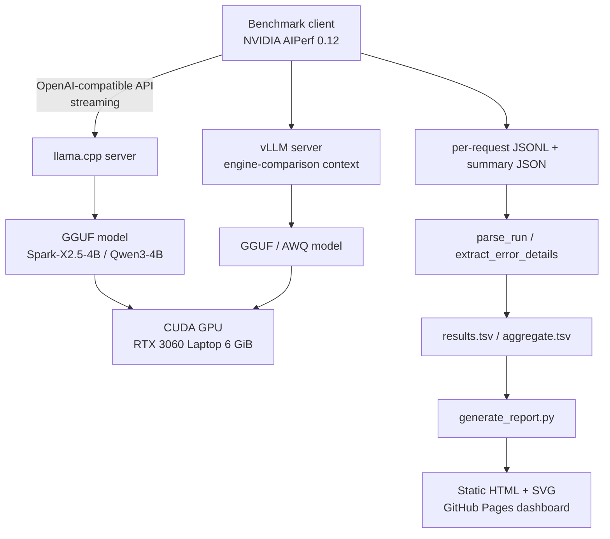

# Architecture

## Overview

The benchmark drives a llama.cpp OpenAI-compatible server (and, in the broader
experiment history, a vLLM server) with NVIDIA AIPerf, captures structured
metrics, and renders them into a static interactive report.

## Components

- **`scripts/benchmark.sh`** — orchestrator. Starts one serving container at a
  time (never both), enforces a thermal gate, runs AIPerf per cell, captures GPU
  telemetry and Docker events, and parses results. A `flock` guard ensures only
  one benchmark runs at a time.
- **`scripts/deploy.sh`** — creates four stopped containers:
  `bench-spark-llama` (8100), `bench-qwen-llama` (8101),
  `bench-qwen-vllm-gguf` (8102), `bench-qwen-vllm-awq` (8103). The first two are
  the published model comparison; the last two are engine-comparison context.
- **`docker/llama-cpp/Dockerfile`** — builds llama.cpp (XHToken fork, CUDA 13.3,
  arch 86) from source.
- **`docker/vllm-gguf/Dockerfile`** — vLLM 0.26.0 + GGUF plugin.
- **`scripts/generate_report.py`** — reads `results/final/*.tsv` and regenerates
  the comparison tables, provenance, dashboard data, interactive HTML, and
  static SVG charts. No displayed number is hand-edited.
- **`monitoring/`** — optional Prometheus + Grafana + Alertmanager +
  node_exporter + cAdvisor stack for the everyday vLLM deployment.

## Port map

| Service | Host port |
|---|---|
| Spark-X2.5 llama.cpp (everyday) | 8000 |
| Qwen3 vLLM (everyday) | 8001 |
| Bench: spark llama.cpp | 8100 |
| Bench: qwen llama.cpp | 8101 |
| Bench: qwen vLLM GGUF | 8102 |
| Bench: qwen vLLM AWQ | 8103 |
| Grafana | 3000 |
| Prometheus | 9090 |
| Alertmanager | 9093 |
| cAdvisor | 8080 |
| node_exporter | 9100 |

All bound to `127.0.0.1` (loopback) only.
