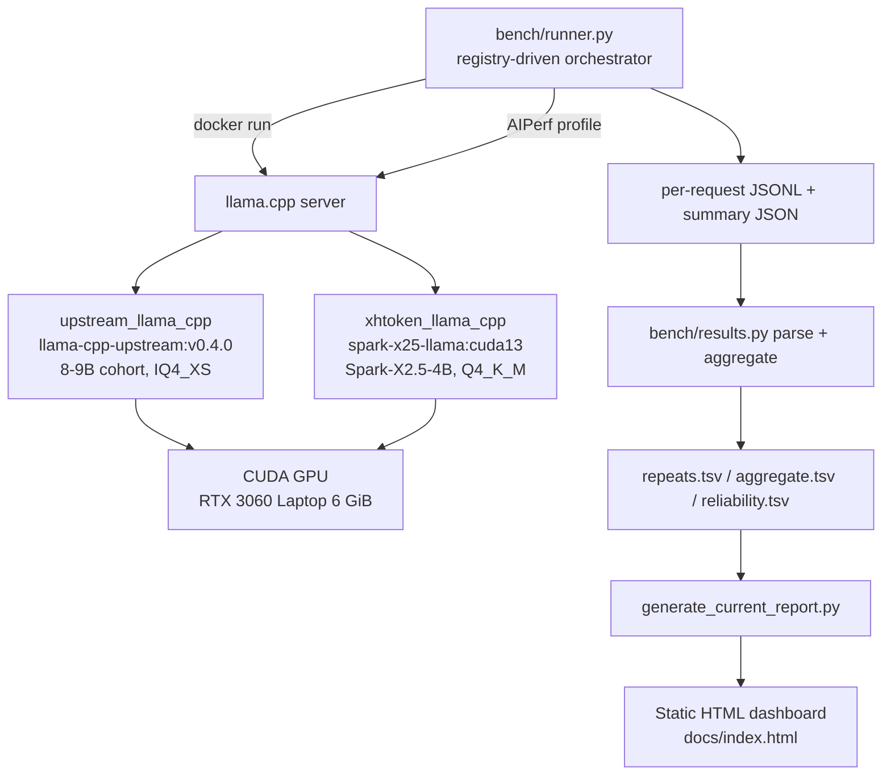

# Architecture

## Overview

The current benchmark drives OpenAI-compatible llama.cpp servers with NVIDIA
AIPerf, captures structured metrics, and renders them into a static dashboard.
The active model set and sweep parameters come from a single registry, not
from hardcoded lists. Two engine profiles are supported: the pinned upstream
`ggml-org/llama.cpp` for the 8-9B cohort, and the XHToken llama.cpp fork for
the Spark-X2.5-4B reference.



## Components

- **`configs/models.json`** — model registry (cohorts, engines, GGUF + SHA256,
  ports, licenses, roles). The single source of truth for the active model
  set. Cohorts: `mainstream_8_9b`, `spark_reference`, `historical_4b`.
- **`configs/benchmark.json`** — sweep parameters (concurrency, repeats,
  requests, shape profiles, sampling, reliability gate).
- **`bench/`** — small Python harness:
  - `config.py` / `models.py` — registry access + engine lookup.
  - `runner.py` — serves each model with its cohort's engine image (identical
    flags) and runs AIPerf per cell
    (`--suite capacity|reliability|shape|startup|soak|open-loop|sessions`),
    with a thermal gate, VRAM/OOM checks, incremental `rows.jsonl`, and
    resume. `--cohort` selects the cohort; the engine image is derived from
    the registry.
  - `results.py` — AIPerf artifact parsing, repeat aggregation (mean + CI95),
    Wilson-95% reliability summary, error classification.
  - `stats.py` — mean/median/stddev, percentiles, Wilson interval.
  - `llama_bench.py` — raw-engine microbenchmark (upstream binary).
- **`scripts/admit_8b9b.sh`** — per-model admission gate (healthcheck,
  generation, 20-request smoke, VRAM/OOM) before a model enters the benchmark.
- **`scripts/generate_current_report.py`** — reads `results/current/` + registry
  and renders `docs/index.html` (self-contained, no CDN).
- **`docker/llama-cpp-upstream/Dockerfile`** — builds llama.cpp from upstream
  tag v0.4.0 (CUDA 13.3, arch 86); targets `llama-server`, `llama-cli`,
  `llama-quantize`, `llama-bench`. Engine: `upstream_llama_cpp`.
- **`docker/llama-cpp/Dockerfile`** — the XHToken llama.cpp fork build for
  Spark-X2.5-4B. Engine: `xhtoken_llama_cpp`.
- **`scripts/benchmark.sh`** + **`scripts/deploy.sh`** — the historical 4B
  shell orchestrator, retained for the historical 4B reproduction.

## Result layout

```
results/current/
  mainstream-8-9b/    # 8-9B cohort (capacity/reliability/shape/startup/...)
  spark-reference/    # Spark-X2.5-4B reference
```

Each suite dir holds `aggregate.tsv`, `repeats.tsv`, `manifest.json`, and
`model_workload.jsonl`; the manifest records engine/image, serving flags,
quantization, GPU, driver/CUDA, AIPerf version, workload hash, run ID, and
git commit.

## Port map (benchmark arms)

| Service | Host port |
|---|---|
| Bench: qwen3_8b | 8200 |
| Bench: deepseek_r1_8b | 8201 |
| Bench: glm4_9b | 8202 |
| Bench: yi_15_9b | 8203 |
| Reference: spark_x2_5_4b (arm `spark_llama`) | 8100 |
| Historical 4B arms (qwen/vllm/phi4/gemma) | 8101-8105 |
| Grafana / Prometheus / Alertmanager / cAdvisor / node_exporter | 3000 / 9090 / 9093 / 8080 / 9100 |

All benchmark ports bind to `127.0.0.1` (loopback) only.
