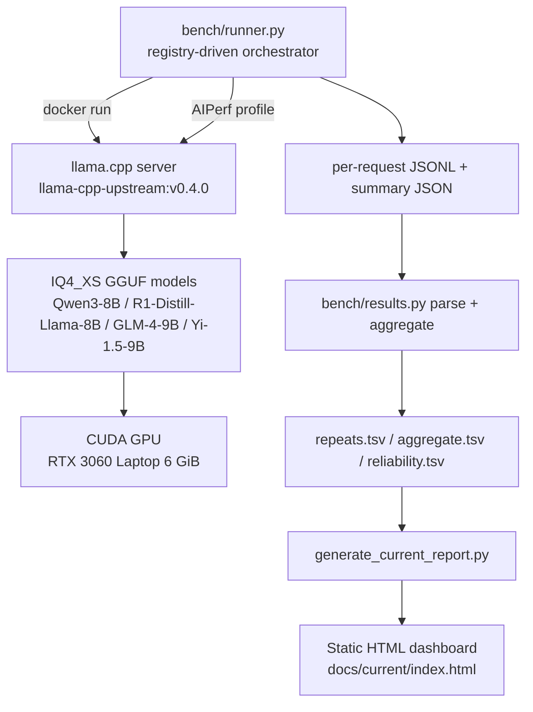

# Architecture

## Overview

The current benchmark drives a llama.cpp OpenAI-compatible server (pinned
upstream ggml-org/llama.cpp) with NVIDIA AIPerf, captures structured metrics,
and renders them into a static dashboard. The active model set and sweep
parameters come from a single registry, not from hardcoded lists.

## Components

- **`configs/models.json`** — model registry (cohorts, GGUF + SHA256, ports,
  licenses). The single source of truth for the active model set.
- **`configs/benchmark.json`** — sweep parameters (concurrency, repeats,
  requests, shape profiles, sampling, reliability gate).
- **`bench/`** — small Python harness:
  - `config.py` / `models.py` — registry access.
  - `runner.py` — serves each model with the pinned image (identical flags) and
    runs AIPerf per cell (`--suite capacity|reliability|shape`), with a thermal
    gate, VRAM/OOM checks, incremental `rows.jsonl`, and resume.
  - `results.py` — AIPerf artifact parsing, repeat aggregation (mean + CI95),
    Wilson-95% reliability summary, error classification.
  - `stats.py` — mean/median/stddev, percentiles, Wilson interval.
  - `llama_bench.py` — raw-engine microbenchmark (same binary).
- **`scripts/admit_8b9b.sh`** — per-model admission gate (healthcheck,
  generation, 20-request smoke, VRAM/OOM) before a model enters the benchmark.
- **`scripts/generate_current_report.py`** — reads `results/current/` + registry
  and renders `docs/current/index.html` (self-contained, no CDN).
- **`docker/llama-cpp-upstream/Dockerfile`** — builds llama.cpp from upstream
  tag v0.4.0 (CUDA 13.3, arch 86), targets `llama-server`, `llama-cli`,
  `llama-quantize`, `llama-bench`.
- **`docker/llama-cpp/Dockerfile`** — historical XHToken fork build for the 4B
  cohort (retained for reproduction only).
- **`scripts/benchmark.sh`** + **`scripts/deploy.sh`** — the historical 4B
  orchestrator (shell + pre-created containers), retained for the 4B cohort.

## Port map (benchmark arms)

| Service | Host port |
|---|---|
| Bench: qwen3_8b | 8200 |
| Bench: deepseek_r1_8b | 8201 |
| Bench: glm4_9b | 8202 |
| Bench: yi_15_9b | 8203 |
| Historical 4B arms (spark/qwen/vllm/phi4/gemma) | 8100-8105 |
| Grafana / Prometheus / Alertmanager / cAdvisor / node_exporter | 3000 / 9090 / 9093 / 8080 / 9100 |

All benchmark ports bind to `127.0.0.1` (loopback) only.
